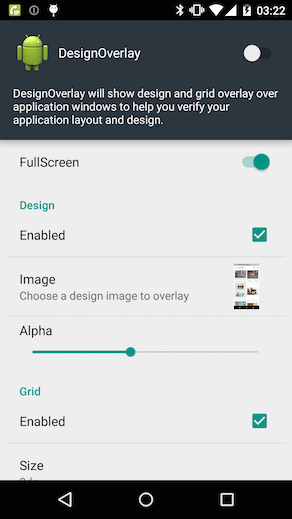
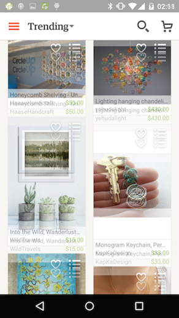
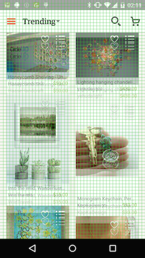

DesignOverlay - for developers and designers
===============
DesignOverlay is an android app which displays a design image with grid lines to facilitate the tedious layout process.
The grid is especially useful to align to baseline grids as described in [Android Design Guidelines][1].

Download from Google Play
-------------------------

<a href="https://play.google.com/store/apps/details?id=com.ms_square.android.design.overlay">
  
</a>

Requirements
-------------
API Level 14 (ICS) and above.

Why is this useful?
---------------------
### Designers
Just share pixel-perfect design images with a developer, no longer need to create a redline document which specifies layout parameters of every UI element.

Note: 
Developers probably also need font styling information to implement your design since font style is hard to guess based on just images.

### Developers
With the design images shared by a designer, you can easily tweak the layout parameters using design image and grid overlay this app provides and verify design implementation. During that process, I highly recommend using [Mirror Plugin for Android Studio][2] provided by jimulabs to even facilitate the process.

How to use
------------
- Start the app and enable the switch on the top right.
- Select an image to overlay.
- Go to your app and see if the layout matches with the design image.



These are just examples of how the overlay will look over an Etsy app.
(I'm using Etsy as an example since it's a great app.)




Available settings
---------------------
- Show/Hide of Image/Grid
- Image to overlay
- Image transparency
- Grid size in dp (default is 4dp)
- Grid line color and transparency
- Fullscreen mode (if enabled, it will draw overlay from the top of the screen -> draws over status bar)

How to build
-------------

```
git submodule update --init
./gradlew assembleDebug
```

Contributors
-------------
[Atsushi Ienaka][3] - application icons and play store images

License
----------

    Copyright 2015 Manabu Shimobe

    Licensed under the Apache License, Version 2.0 (the "License");
    you may not use this file except in compliance with the License.
    You may obtain a copy of the License at

    http://www.apache.org/licenses/LICENSE-2.0

    Unless required by applicable law or agreed to in writing, software
    distributed under the License is distributed on an "AS IS" BASIS,
    WITHOUT WARRANTIES OR CONDITIONS OF ANY KIND, either express or implied.
    See the License for the specific language governing permissions and
    limitations under the License.

[1]: http://www.google.com/design/spec/layout/metrics-keylines.html#
[2]: http://jimulabs.com/
[3]: https://dribbble.com/ATSUBOYYY
